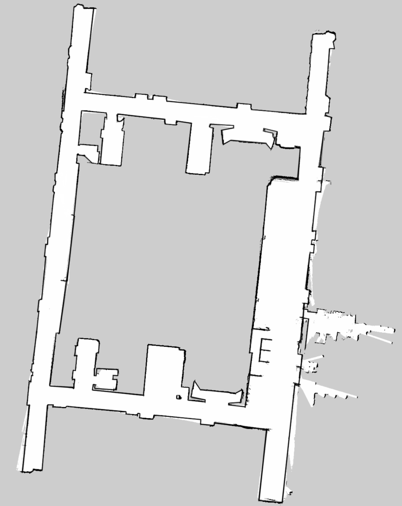
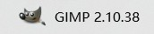

# Laser_Cartographer_ROS2
Based on cartographer and fishros, the warehouse implemented pure radar mapping in ros2 humble. In short, it only needs radar publication /scan topic instead of /odom to realize map construction. Most of the parameters have been adjusted. It has been tested on multiple radars with success.

<p align="center">
  
</p>

## Install And Use
```bash
$ colcon build
$ . install/setup.bash
$ ros2 launch laser_cartographer cartographer_pure_laser.launch.py
```

## How To Save
```bash
$ ros2 run nav2_map_server map_saver_cli -f {mapname}.pgm
```

## In general, we will use retouching software such as GUN to modify the.pgm file to make it better in the navigation.
<p align="center">
  
</p>


## Main Parameter(laser_2d.lua)
```bash
-- 0改成0.10,比机器人半径小的都忽略
TRAJECTORY_BUILDER_2D.min_range = 0.10
-- 30改成3.5,限制在雷达最大扫描范围内，越小一般越精确些
TRAJECTORY_BUILDER_2D.max_range = 20.0
-- 5改成3,传感器数据超出有效范围最大值
TRAJECTORY_BUILDER_2D.missing_data_ray_length = 5.
-- true改成false,不使用IMU数据
TRAJECTORY_BUILDER_2D.use_imu_data = false
-- false改成true,使用实时回环检测来进行前端的扫描匹配
TRAJECTORY_BUILDER_2D.use_online_correlative_scan_matching = true 
-- 1.0改成0.1,提高对运动的敏感度
-- TRAJECTORY_BUILDER_2D.motion_filter.max_angle_radians = math.rad(0.1)
-- 0.55改成0.65,Fast csm的最低分数，高于此分数才进行优化。
POSE_GRAPH.constraint_builder.min_score = 0.65
--0.6改成0.7,全局定位最小分数，低于此分数则认为目前全局定位不准确
POSE_GRAPH.constraint_builder.global_localization_min_score = 0.7
```
